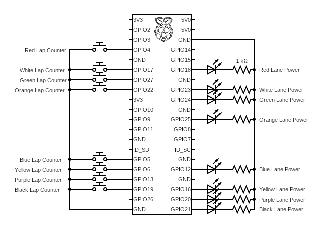

# piSlot

Open source slot car track and race software for rasberry pi.

## Description

piSlot is designed to control slot car tracks and races with a terminal interface, using a rasberry pi to track laps and control track power.

## Getting Started

### Dependencies

* Rasberry pi model 3 or higher
* piSlot circuit

#### piSlot Development Circuit

This circuit allows for developing and testing piSlot, using push buttons for the lap counter, and LEDs instead of relay's for track lane power.

### Installing

This project uses a makefile for setting up a pi for development using `make prepare-pi-dev`

### Starting piSlot

`make run`

## License

This project is licensed under the MIT License - see the LICENSE.md file for details

## Acknowledgments

Inspiration, code snippets, etc.

* [Slot Racing Technology](https://www.slotracingtechnology.com/)
